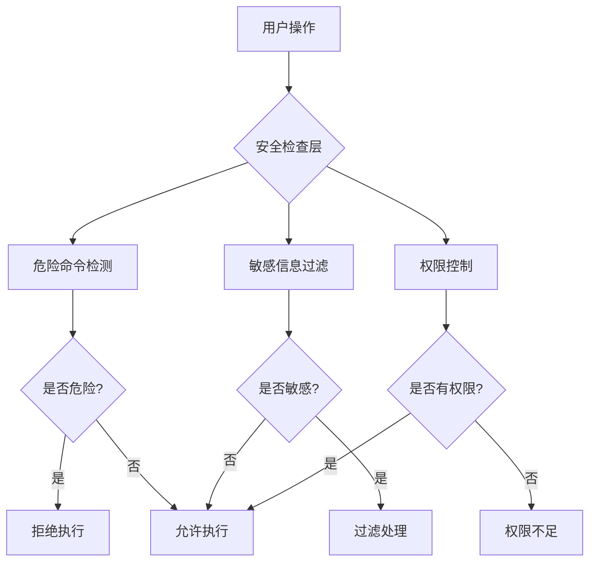

# FluxWorker

<div align="center">


✨ **FluxWorker** - AI驱动的智能编程助手桌面应用

由Flux-Coder-Omni模型驱动，为开发者提供强大的AI辅助编程体验

[](LICENSE)
[](https://github.com/YEHE-Team/FluxWorker/stargazers)
[](https://github.com/YEHE-Team/FluxWorker/network/members)
[](https://github.com/YEHE-Team/FluxWorker/issues)
[](https://github.com/YEHE-Team/FluxWorker/pulls)
[](https://github.com/YEHE-Team/FluxWorker/releases)

</div>

---

## 📋 目录

- [项目概述](#-项目概述)
- [核心功能](#-核心功能)
- [技术栈](#️-技术栈)
- [安装与运行](#️-安装与运行)
- [使用指南](#-使用指南)
- [配置说明](#️-配置说明)
- [项目结构](#-项目结构)
- [内置工具列表](#️-内置工具列表)
- [贡献指南](#-贡献指南)
- [常见问题](#-常见问题)
- [许可证](#-许可证)

---

## 🌟 项目概述

**FluxWorker** 是一款基于AI的智能编程助手桌面应用，由 YEHE-Team 开发。它采用先进的 **Flux-Coder-Omni** 模型，为开发者提供智能代码补全、代码生成、错误修复和项目管理等全方位辅助。

### 项目定位

FluxWorker 定位为开发者的AI编程伙伴，类似于 Cursor、Claude Code 等工具，但具有以下独特优势：

- **完整的AI Agent循环**：自动化的任务理解、规划、执行和反馈
- **丰富的工具生态**：15+内置工具，支持文件操作、代码执行、Git集成等
- **强大的安全机制**：多层安全防护，确保代码执行安全可靠
- **跨平台支持**：Windows、macOS、Linux 全平台覆盖

### 核心特性

- 🤖 **AI驱动编程辅助**：智能代码生成、补全、重构和调试
- 🔧 **15+内置工具**：文件读写、代码执行、Git操作、浏览器控制等
- 🔌 **MCP协议支持**：Model Context Protocol，支持自定义工具扩展
- 🛡️ **智能安全机制**：危险命令检测、敏感信息过滤、权限控制、沙箱执行
- 💬 **多会话管理**：支持多个独立会话，上下文隔离
- 🔄 **自动更新**：无缝更新机制，保持最新功能

---

## 🚀 核心功能

### 1. AI Agent 完整循环

FluxWorker 实现了完整的AI Agent工作循环：


- **自动任务分解**：将复杂任务拆解为可执行的子任务
- **智能工具选择**：根据任务类型自动选择最合适的工具
- **实时进度追踪**：清晰展示任务执行状态
- **错误自动恢复**：遇到问题时自动调整策略

### 2. 15+ 内置工具

FluxWorker 提供丰富的内置工具，覆盖开发全流程：

| 工具类别 | 工具名称 | 功能描述 |
|---------|---------|---------|
| **文件操作** | `read_file` | 读取文件内容 |
| | `write_file` | 写入或创建文件 |
| | `edit_file` | 编辑现有文件 |
| | `glob` | 按模式搜索文件 |
| | `grep` | 搜索文件内容 |
| | `list_directory` | 列出目录内容 |
| **代码执行** | `run_shell` | 执行Shell命令 |
| | `run_terminal` | 执行终端命令 |
| **版本控制** | `git_status` | 查看Git状态 |
| | `git_commit` | 创建Git提交 |
| | `git_diff` | 查看代码差异 |
| **网络工具** | `fetch_url` | 获取URL内容 |
| | `http_request` | 发送HTTP请求 |
| **系统工具** | `system_info` | 获取系统信息 |
| | `clipboard` | 剪贴板操作 |

### 3. MCP 协议支持

Model Context Protocol (MCP) 是一个开放的工具集成标准：

- **标准化接口**：统一的工具调用规范
- **自定义扩展**：支持开发自定义工具
- **生态兼容**：兼容第三方MCP工具
- **动态加载**：运行时动态加载工具

### 4. 智能安全机制

FluxWorker 实现了多层安全防护：



**安全特性**：
- ⚠️ **危险命令检测**：自动识别和阻止危险操作（如 `rm -rf /`）
- 🔒 **敏感信息过滤**：自动识别和保护密码、密钥等敏感信息
- 👤 **权限控制**：细粒度的权限管理，用户可控制AI可访问的资源
- 🐳 **沙箱执行**：代码在隔离环境中执行，防止系统污染

### 5. 多会话管理

支持同时管理多个独立会话：

- **会话隔离**：不同会话的上下文相互独立
- **快速切换**：一键切换不同会话
- **历史保存**：自动保存会话历史
- **会话模板**：支持创建常用会话模板

### 6. 自动更新

无缝的自动更新机制：

- **后台检查**：自动检查新版本
- **增量更新**：只下载变更部分，节省带宽
- **静默更新**：后台下载，不影响工作
- **回滚支持**：更新失败时自动回滚

---

## 🛠️ 技术栈

### 前端技术

| 技术 | 版本 | 用途 |
|------|------|------|
| **React** | 18.3.1 | UI框架 |
| **TypeScript** | 5.5.3 | 类型安全 |
| **Tailwind CSS** | 3.4.6 | 样式方案 |
| **Vite** | - | 构建工具 |
| **electron-vite** | 2.3.0 | Electron构建 |

### 桌面框架

| 技术 | 版本 | 用途 |
|------|------|------|
| **Electron** | 31.0.0 | 桌面应用框架 |
| **electron-builder** | - | 应用打包 |

### AI模型

| 模型 | 说明 |
|------|------|
| **Flux-Coder-Omni** | 自研AI编程模型 |

### 平台支持

- ✅ Windows 10+ (x64)
- ✅ macOS 10.15+ (Intel & Apple Silicon)
- ✅ Linux (Ubuntu 18.04+, Debian 10+, Fedora 32+)

---

## 🎯 安装与运行

### 系统要求

- **操作系统**：Windows 10+、macOS 10.15+、Linux (主流发行版)
- **Node.js**：v18.0.0 或更高版本
- **npm**：v9.0.0 或更高版本
- **磁盘空间**：至少 500MB 可用空间

### 从源码构建

```bash
# 1. 克隆仓库
git clone https://github.com/YEHE-Team/FluxWorker.git

# 2. 进入项目目录
cd FluxWorker

# 3. 安装依赖
npm install

# 4. 启动开发模式
npm run dev

# 5. 构建生产版本
npm run build

# 6. 打包应用
npm run dist
```

### 平台特定构建

```bash
# Windows 版本
npm run dist:win

# macOS 版本
npm run dist:mac

# Linux 版本
npm run dist:linux
```

### 下载预编译版本

访问 [GitHub Releases](https://github.com/YEHE-Team/FluxWorker/releases) 下载最新版本。

---

## 📖 使用指南

### 基本工作流程

1. **启动应用**：双击应用图标或运行命令
2. **创建会话**：点击 "+" 创建新会话
3. **输入任务**：在输入框描述你的编程需求
4. **查看结果**：AI 会自动执行任务并展示结果
5. **继续交互**：根据结果继续对话

### 内置斜杠命令

| 命令 | 功能描述 | 示例 |
|------|---------|------|
| `/help` | 显示帮助信息 | `/help` |
| `/clear` | 清空当前对话 | `/clear` |
| `/compact` | 压缩上下文 | `/compact` |
| `/undo` | 撤销上一步操作 | `/undo` |
| `/diff` | 显示代码变更 | `/diff` |
| `/review` | 代码审查 | `/review` |
| `/tests` | 生成测试用例 | `/tests` |
| `/git` | Git操作 | `/git status` |
| `/memory` | 管理长期记忆 | `/memory list` |
| `/rules` | 查看项目规则 | `/rules show` |
| `/mcp` | MCP工具管理 | `/mcp list` |
| `/sessions` | 管理会话 | `/sessions list` |
| `/config` | 查看配置 | `/config show` |
| `/workspace` | 工作区管理 | `/workspace info` |

### 使用示例

**示例1：代码生成**
```
用户：请帮我创建一个React组件，实现一个带搜索功能的下拉菜单
AI：[分析需求] → [生成代码] → [写入文件] → [展示结果]
```

**示例2：代码重构**
```
用户：请优化这段代码的性能
AI：[分析代码] → [识别问题] → [重构代码] → [展示差异]
```

**示例3：错误调试**
```
用户：这段代码有bug，请帮我修复
AI：[分析错误] → [定位问题] → [修复代码] → [测试验证]
```

---

## ⚙️ 配置说明

### 配置文件位置

配置文件位于用户主目录下：

```
~/.fluxworker/config.json
```

### 环境变量配置

创建 `.env` 文件或设置系统环境变量：

```env
# AI模型配置
VITE_AI_API_KEY=your_api_key_here
VITE_AI_API_URL=https://api.flux-ai.com/v1

# 应用配置
VITE_APP_NAME=FluxWorker
VITE_APP_VERSION=1.0.0

# 开发配置
VITE_DEV_SERVER_PORT=3000
```

### 应用内配置

通过应用设置面板配置：

1. **AI设置** → 模型选择、API密钥、超时时间
2. **外观设置** → 主题、字体、布局
3. **编辑器设置** → 自动保存、代码补全、格式化
4. **安全设置** → 权限控制、沙箱模式
5. **高级设置** → 调试模式、日志级别

---

## 📁 项目结构

```
fluxworker/
├── electron/                  # Electron主进程
│   ├── main.ts               # 主进程入口
│   ├── preload.ts            # 预加载脚本
│   └── ipc/                  # IPC通信处理
├── src/                      # 前端源代码
│   ├── App.tsx               # 主应用组件
│   ├── components/           # React组件
│   │   ├── SettingsPanel.tsx # 设置面板
│   │   └── ...
│   ├── pages/                # 页面组件
│   ├── hooks/                # 自定义Hooks
│   ├── utils/                # 工具函数
│   │   └── toolExecutor.ts   # 工具执行器
│   ├── styles/               # 全局样式
│   └── types/                # TypeScript类型定义
├── resources/                # 应用资源
│   ├── icons/                # 应用图标
│   └── themes/               # 编辑器主题
├── scripts/                  # 构建脚本
├── dist/                     # 构建输出
├── out/                      # 编译输出
├── electron-builder.yml      # 打包配置
├── electron-vite.config.ts   # Vite配置
└── package.json              # 项目配置
```

### 核心模块说明

| 模块 | 说明 |
|------|------|
| **main/** | Electron主进程，负责系统级操作 |
| **renderer/** | 前端界面，基于React构建 |
| **preload/** | 预加载脚本，桥接主进程和渲染进程 |
| **toolSystem/** | 工具执行系统，管理15+内置工具 |
| **memorySystem/** | 长期记忆系统，支持跨会话知识保留 |
| **securitySystem/** | 安全系统，实现多层安全防护 |

---

## 🔧 内置工具列表

### 文件操作工具

| 工具 | 参数 | 说明 |
|------|------|------|
| `read_file` | `path: string` | 读取文件内容 |
| `write_file` | `path: string, content: string` | 写入文件 |
| `edit_file` | `path: string, old: string, new: string` | 编辑文件 |
| `glob` | `pattern: string` | 按模式搜索文件 |
| `grep` | `pattern: string, path: string` | 搜索文件内容 |
| `list_directory` | `path: string` | 列出目录内容 |

### 代码执行工具

| 工具 | 参数 | 说明 |
|------|------|------|
| `run_shell` | `command: string` | 执行Shell命令 |
| `run_terminal` | `command: string` | 执行终端命令 |

### Git工具

| 工具 | 参数 | 说明 |
|------|------|------|
| `git_status` | - | 查看Git状态 |
| `git_commit` | `message: string` | 创建提交 |
| `git_diff` | - | 查看差异 |

### 网络工具

| 工具 | 参数 | 说明 |
|------|------|------|
| `fetch_url` | `url: string` | 获取URL内容 |
| `http_request` | `url, method, headers, body` | HTTP请求 |

### 系统工具

| 工具 | 参数 | 说明 |
|------|------|------|
| `system_info` | - | 获取系统信息 |
| `clipboard` | `action: string, content?: string` | 剪贴板操作 |

---

## 🤝 贡献指南

我们欢迎社区贡献！请遵循以下流程：

### 开发环境搭建

```bash
# 克隆仓库
git clone https://github.com/YEHE-Team/FluxWorker.git
cd FluxWorker

# 安装依赖
npm install

# 启动开发模式
npm run dev
```

### 提交规范

使用 [Conventional Commits](https://www.conventionalcommits.org/) 规范：

```
feat: 新功能
fix: 修复bug
docs: 文档更新
style: 代码格式调整
refactor: 代码重构
test: 测试相关
chore: 构建/工具链更新
perf: 性能优化
ci: CI/CD配置
```

### Pull Request 流程

1. Fork 本仓库
2. 创建特性分支：`git checkout -b feature/AmazingFeature`
3. 提交更改：`git commit -m 'feat: Add some AmazingFeature'`
4. 推送分支：`git push origin feature/AmazingFeature`
5. 创建 Pull Request

### 代码规范

- 使用 TypeScript 编写代码
- 遵循 ESLint 和 Prettier 配置
- 添加必要的注释和文档
- 编写单元测试（如适用）

---

## ❓ 常见问题

### Q: 如何获取AI API密钥？

A: 访问 [Flux-AI 官网](https://flux-ai.com) 注册并获取API密钥。

### Q: 支持哪些操作系统？

A: 支持 Windows 10+、macOS 10.15+ 和主流 Linux 发行版。

### Q: 如何启用沙箱模式？

A: 在设置 → 安全设置 → 沙箱执行 中开启。

### Q: 如何自定义工具？

A: 通过MCP协议集成自定义工具，参考 [MCP文档](https://modelcontextprotocol.io)。

### Q: 更新失败怎么办？

A: 可以手动下载最新版本安装，或在设置中检查更新。

---

## 📄 许可证

本项目使用 MIT 许可证 - 查看 [LICENSE](LICENSE) 文件了解详情。

---

## 🙏 致谢

感谢以下开源项目和社区：

- [Electron](https://www.electronjs.org/) - 桌面应用框架
- [Vite](https://vitejs.dev/) - 下一代前端构建工具
- [React](https://react.dev/) - 用于构建用户界面的JavaScript库
- [Tailwind CSS](https://tailwindcss.com/) - 实用优先的CSS框架
- [TypeScript](https://www.typescriptlang.org/) - JavaScript的超集

---

<div align="center">

**FluxWorker** - 让AI成为你的编程伙伴 ✨

⭐ 如果这个项目对你有帮助，请给我们一个Star！

</div>
